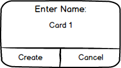
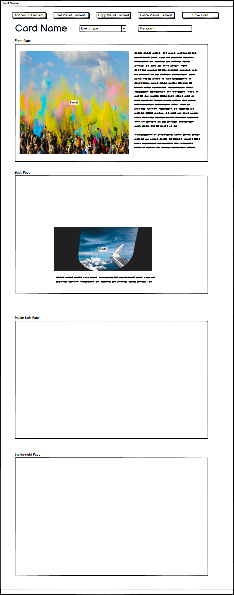
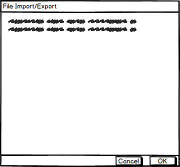

# WPI_CS509

## Project title

Card Maker

## Name

Zekun Dai

George Heineman(Instructor)

## Motivation

A short description of the motivation behind the creation and maintenance of the project. This should explain **why** the project exists.

## Design Documents

### Mockup

1.User opens the app, and it shows the first menu panel. As follows, it has 2 buttons: "Create Card", "Card List".

2.If user clicks "Create Card" button, the app opens a new panel shows a dialog for user to enter the cards name. If clicks "cancel", it returns 1.

If user clicks "create", then the app opens a new window that shows the main app window, with the option to see "front page", "back page", "Inside-left page" and "Inside-right page". In current window, it has 5 buttons "Add visual element",  "Del visual element", "Copy visual element", "Paste visual element", "Save", "Add visual element",on top and with card name below buttons. Alongside the card name, the user can choose event type of the card, and has an input box to enter the recipient's name.

    2.1 If user clicks "Add visual element" button, user can add ether image or text to the "front page" section.
    2.2 If user clicks "Del visual element" button, user can delete ether image or text to the "front page" section.
    2.3 If user clicks "Copy visual element" button, user can copy selected image or text from the "front page" section.
    2.4 If user clicks "Paste visual element" button, user can paste selected image or text from the "front page" section of same or different card.
    2.5 If user clicks "Save" button, the app saves the created card to certain format, and can be loaded at later times.
    
3.If user clicks "Card List" button, the app opens a new panel that shows current in-library cards. Along with 5 buttons on the top "Load card",  "Delete card",  "Duplicate card",  "Display card",  "Create card", 

3.1.If user clicks "Load Card" button, the app shows import window for user to select the saved card that the user wants to load.

3.2.If user selects a card and clicks "Delete Card" button, the app deletes the card from library.

3.3.If user selects a card and clicks "Duplicate Card" button, the app duplicates the card.

3.4.If user selects a card and clicks "Display Card" button, the app opens main window like in 2.

3.5.If user selects a card and clicks "Create Card" button, the app follows process like 2.

## Build status

Build status of continus integration i.e. travis, appveyor etc. Ex. -

## Code style

If you're using any code style like xo, standard etc. That will help others while contributing to your project. Ex. -

## Screenshots

Include logo/demo screenshot etc.

## Tech/framework used

Ex. -

<b>Built with</b>

- [Electron](https://electron.atom.io)

## Features

What makes your project stand out?

## Code Example

Show what the library does as concisely as possible, developers should be able to figure out **how** your project solves their problem by looking at the code example. Make sure the API you are showing off is obvious, and that your code is short and concise.

## Installation

Provide step by step series of examples and explanations about how to get a development env running.

## API Reference

Depending on the size of the project, if it is small and simple enough the reference docs can be added to the README. For medium size to larger projects it is important to at least provide a link to where the API reference docs live.

## Tests

Describe and show how to run the tests with code examples.

## How to use?

If people like your project they’ll want to learn how they can use it. To do so include step by step guide to use your project.

## Contribute

Let people know how they can contribute into your project. A [contributing guideline](https://github.com/zulip/zulip-electron/blob/master/CONTRIBUTING.md) will be a big plus.

## Credits

Give proper credits. This could be a link to any repo which inspired you to build this project, any blogposts or links to people who contrbuted in this project.

#### Anything else that seems useful

## License

A short snippet describing the license (MIT, Apache etc)

MIT © [Yourname]()
